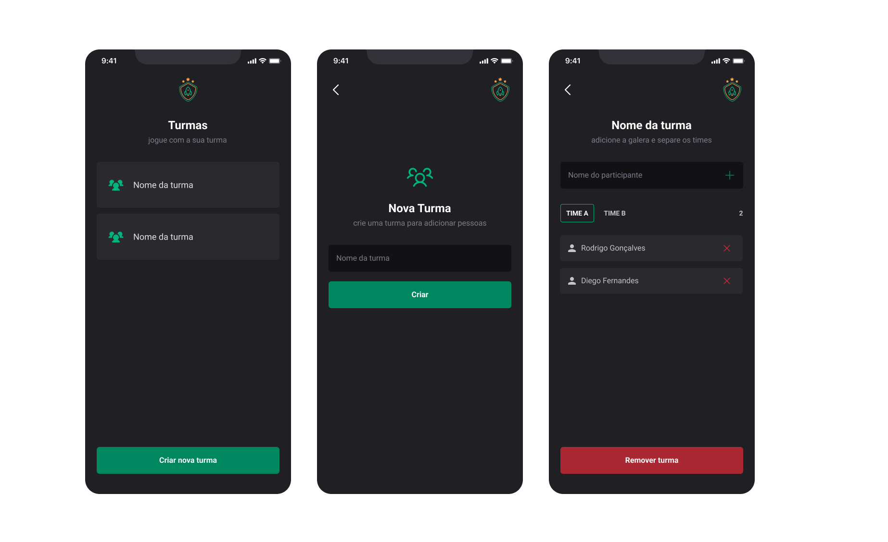

<p align="center">
  
</p>

# Ignite Teams
Projeto desenvolvido na trilha de react native do programa Ignite da Rocketseat.

## Protótipo


## Bibliotecas utilizadas
- [Babel-plugin-module-resolver](https://www.npmjs.com/package/babel-plugin-module-resolver)
Criação de paths dinâmicos
```bash
  npm install --save-dev babel-plugin-module-resolver
```

- [Styled-components](https://styled-components.com/docs)
Estilização CSS-IN-JS
```bash
  npm install styled-components

  npm install --save-dev @types/styled-components @types/styled-components-react-native
```

- [Expo-google-fonts](https://docs.expo.dev/guides/using-custom-fonts/#using-a-google-font)
Utilização da fonte Roboto com expo fonts
```bash
  expo install expo-font @expo-google-fonts/roboto
```

- [Phospor-icons](https://phosphoricons.com/)
Biblioteca de icones
```bash
  npm install --save phosphor-react-native

  expo install react-native-svg
```

- [React-navigation](https://reactnavigation.org/docs/getting-started/)
Navegação entre telas
```bash
  npm install @react-navigation/native

  npx expo install react-native-screens react-native-safe-area-context

  npm install @react-navigation/native-stack
```

- [Async-storage](https://docs.expo.dev/versions/latest/sdk/async-storage/)
Armazenamento local no dispositivo
```bash
  npx expo install @react-native-async-storage/async-storage
```